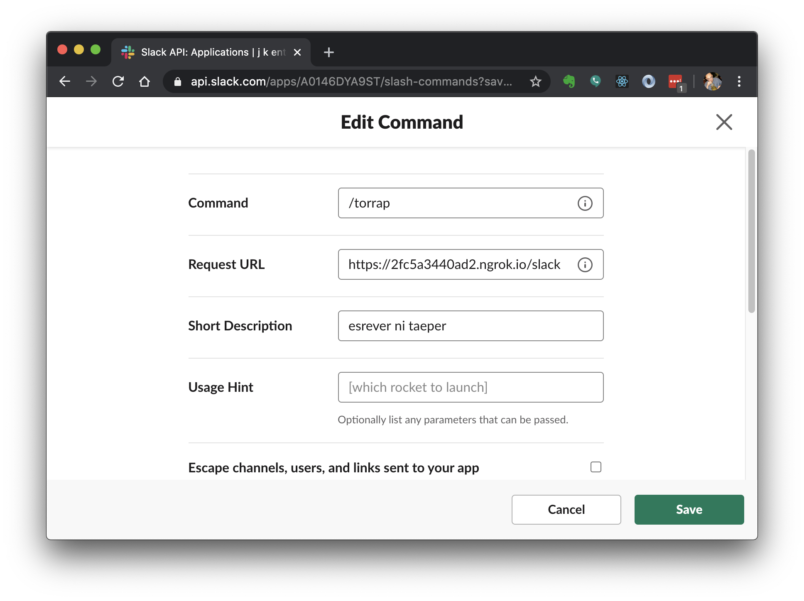

# Building a Slackbot with Python

In this lesson we build a simple Slackbot using python.

## Webhooks

Let's say we want to create an online application that performs tasks for us. How does one build that? The concept has had many names, including: RPC, web callbacks, and others. The modern iteration is called a webhook. This is, essentially, an endpoint that can be called from anywhere and that will perform a task for the caller.

Because building webhooks is straightforward, and because integrating disperate systems can be complicated, most large APIs give you webhooks to act as the entrypoint for hooking in to their system. As an example, GitHub can be configured to call any webhook you'd like after an event happens in a project (such as whenever a branch is merged to master). You can tell GitHub to notify, say, your cloud service provider that a new build should happen; that provider then will call your tooling in their system to start the build/deploy pipeline. Note that GitHub doesn't need to know how your build system works, it just needs to know how to tell the build system that something has changed.

## Slackbots

Slack provides a collection of mechanisms for tying into their system from yours. The easiest to create is a Slackbot. A Slackbot is simply a webhook that receives requests from Slack and that then replies back immediately or after some time. You can make them direct and straightforward (such as simply replying once to each received message) or something fairly complex (like the ability to orchestrate deployments of your production system).

Slack recognizes that our endpoint is accessible to the world, so they digitally sign every message they send so that we can confirm they really were the sender.

## The app

Our Slackbot will take any message it receives and reverse it, then post it back as a reply. We will invoke it using a [slash command](https://api.slack.com/interactivity/slash-commands).

A secondary goal is to maximize throughput of our app. We've learned recently about [asyncio](../asyncio/asyncio.ipynb) and recognize that this is an ideal candidate for an event loop.

### Architecture

The app will act as a web server that receives requests directed to the path(s) we specify. In our case we will receive on a single path, `/slack`. We accept `POST` only, and we know the expected format of every valid message we will receive.

Slack requires that we acknowledge receipt of every message within 3000ms (3 seconds). Since our actual work within our app might take longer than that, we will start a new background task to do the work and send the reply, and we will then immediately return a success response to Slack so they know the message was received.

Finally, once the task has completed, our app will call Slack back with the reply.

See the [complete source](./slackbot.py) if you are having trouble with any of this.

### Startup and shutdown

This is some fairly boiler-plate code that handles starting the program, configuring logging, setting up the event loop, and putting a mechanism in place for gracefully stopping everything:

```python
import asyncio
import hmac
import logging
import os
import time

from aiohttp import web
from aiohttp import ClientSession


log = logging.getLogger(__name__)

#
# signing secret from Slack for validating messages
#

SLACK_SIGNING_SECRET = os.environ.get('SLACK_SIGNING_SECRET')

#
# main loop
#

def main():
    log.info('startup')
    event_loop = asyncio.get_event_loop()
    event_loop.set_debug(True)
    bot = Slackbot()
    task = asyncio.Task(bot.run(), loop=event_loop)
    try:
        event_loop.run_until_complete(task)
    except KeyboardInterrupt:
        log.info('stopping...')
        cancel(event_loop, task)
    event_loop.close()
    log.info('shutdown')

#
# keyboard interrupt handling
#

def cancel(event_loop, task):
    task.cancel()
    while asyncio.all_tasks(event_loop):
        log.debug('awaiting in-process task completion')
        event_loop.run_until_complete(asyncio.sleep(1))
    try:
        task.exception()
    except asyncio.CancelledError:
        log.debug('consumed cancellation exception')
    log.info('all tasks stopped')

#
# entrypoint
#

if __name__ == '__main__':
    rootLogger = logging.getLogger()
    rootLogger.addHandler(logging.StreamHandler())
    rootLogger.setLevel(getattr(logging, os.environ.get('LOG_LEVEL', 'debug').upper()))
    logging.getLogger('asyncio').setLevel(logging.WARNING)
    main()
```

Most of this code is about graceful shutdown. The way we stop our program is with `ctrl-c`, but since we have several tasks in the task queue at any point, we need to signal them to exit and await the end of the last one.

We reference the class `Slackbot` in `main()`... that class will need to provide a method called `run()` and exit when given a cancel signal:

```python
#
# bot implementation
#

class Slackbot:

    app = web.Application()

    async def run(self):
        log.info('starting slackbot')
        runner = web.AppRunner(self.app)
        await runner.setup()
        site = web.TCPSite(runner, 'localhost', 8000)
        self.client = ClientSession()
        try:
            await site.start()
            while True:
                await asyncio.sleep(600)
        except asyncio.CancelledError:
            log.info('received cancellation signal')
            await site.stop()
        except Exception as e:
            log.exception('unhandled exception: %s', e)
        finally:
            await self.client.close()
        log.info('stopped slackbot')
```

The primary task of the `run()` method is to set up the server that will receive requests. In the case of a cancel being sent to the bot, it cleans itself up and exits.

We want to add two routes to the app, so we'll do that in the bot constructor:

```python
class Slackbot():  # continued

    # ...

    def __init__(self):
        routes = [
            web.get('/healthz', self.healthz),
            web.post('/slack', self.slack),
        ]
        self.app.add_routes(routes)
```

The first route is a healthcheck at `/healthz`, and we won't bother to protect it, we will instead reply with a trivial response:

```python
class Slackbot():  # continued

    # ...

    async def healthz(self, request):
        log.info('health check')
        response = dict(success=True, timestamp=time.time())
        return web.json_response(response)
```

The implementation for the `/slack` route is more complex:

```python
class Slackbot():  # continued

    # ...

    async def slack(self, request):
        log.info('slack')
        try:
            await self.validate_slack_message(request)
            asyncio.get_event_loop().create_task(self.send_response(request))
            return web.Response()
        except Exception as e:
            log.exception(e)
            raise web.HTTPUnauthorized()
```

First we await the validation of the message, then we create a new task on the event loop to do the work. This allows our primary task to complete and respond back to Slack before the user request times out.

Validation looks like this:

```python
class Slackbot():  # continued

    # ...

    async def validate_slack_message(self, request):
        log.debug('validating')
        headers = request.headers
        body = await request.text()
        timestamp = headers.get('X-Slack-Request-Timestamp')
        log.debug('timestamp: %s', timestamp)
        if not timestamp or abs(time.time() - int(timestamp)) > 60:
            log.error('message is too old')
            raise AssertionError('invalid timestamp')
        digest = await self.compute_slack_digest(timestamp, body)
        expected = headers.get('X-SLACK-SIGNATURE')
        if not hmac.compare_digest(digest, expected):
            log.debug('hash mismatch: %s %s', digest, expected)
            raise AssertionError('slack validation failed')

    async def compute_slack_digest(self, timestamp, body):
        document = f'v0:{timestamp}:{body}'.encode()
        log.debug('document: %s', document)
        digest = hmac.new(SLACK_SIGNING_SECRET.encode(), document, 'sha256').hexdigest()
        log.debug('digest: %s', digest)
        return f'v0={digest}'
```

This is doing 3 things:

1. confirm the original message is recent (within 60 seconds)
1. compute the signature of the message body
1. compare our computed signature to Slack's claim of what it should be to determine validity

The final step is to send a response back to Slack:

```python
class Slackbot():  # continued

    # ...

    async def send_response(self, request):
        try:
            log.debug('reversing a string seems hard...')
            data = await request.post()
            log.debug('data: %s', data)
            for i in range(5):
                log.debug('thinking...')
                await asyncio.sleep(1)
            message = data.get('text')
            reply = message[::-1]
            log.info('sending reply: %s', reply)
            async with self.client.post(data.get('response_url'), json=dict(text=reply)):
                log.debug('successfully sent reply')
        except Exception as e:
            log.exception(e)

```

Since reversing strings is "hard work", we have a loop that delays for a few seconds to simulate that hard work (clearly reversing a string is trivial). In our example, we are only responding on the channel our command was invoked on. For this we can just use the `response_url` provided in the original request.

## Trying it out

### ngrok

We want to test this locally, but to test it we need to actually receive messages from Slack. [`ngrok`](https://ngrok.com) is designed for this problem. `ngrok` tunnels traffic from an HTTPS-terminated endpoint to the desired port on your machine. This assumes you followed the directions to get `ngrok` installed (MacOS users with Homebrew just do `brew cask install ngrok`).

```sh
$ ngrock http 8000  # we want HTTP/HTTPS traffic routed to port 8000 locally
ngrok by @inconshreveable      (Ctrl+C to quit)

Session Status                online
Session Expires               7 hours, 59 minutes
Version                       2.3.35
Region                        United States (us)
Web Interface                 http://127.0.0.1:4040
Forwarding                    http://2fc5a3440ad2.ngrok.io -> http://localhost:8000
Forwarding                    https://2fc5a3440ad2.ngrok.io -> http://localhost:8000

Connections                   ttl     opn     rt1     rt5     p50     p90
                              0       0       0.00    0.00    0.00    0.00
```

### Slack

[Slack](https://slack.com) has a great API, and the [API documentation](https://api.slack.com/start) is pretty good overall. In our case, we are simply creating an app and configuring the slash command, pasting the URL we got back from `ngrock`:



Since this bot reverses strings, I'm calling it **torrap** (that's "parrot" in reverse), and the short description shows an example of the output.

We also use the credentials Slack generated for us to secure communications. For our app, we just need to reveal and copy the **Signing Secret**:


... and then add them to our environment:

```sh
$ export SLACK_SIGNING_SECRET=<paste from slack>
```

**Note:** there must be no spaces around the equals sign.

### Execution

Now we can send a message from slack and see it appear locally. First, start the python app:

```sh
$ LOG_LEVEL=debug python slackbot.py
startup
starting slackbot
```

**Note:** I am invoking this with a custom logging level. It is written so that `logging.INFO` is used by default but you can override that by providing an alternate value in the `LOG_LEVEL` environment variable as shown above. Running it without that prefix will output just normal messages.

Now go to Slack and type `/torrap sdrawkcab si siht` and press enter. You should see activity in your console:

```sh
# ... continued python console
slack
validating
timestamp: 1591158020
document: b'v0:1591158020:token=V9lxXz8URyNTWTr5S3eHK2gU&team_id=T055823T3&team_domain=jelias&channel_id=D1KMLKZBP&channel_name=directmessage&user_id=U055823TD&user_name=jelias&command=%2Ftorrap&text=sdrawkcab+si+siht&response_url=https%3A%2F%2Fhooks.slack.com%2Fcommands%2FT055823T3%2F1184817307488%2FWLOYjubzcVw4dtSgUzmandBs&trigger_id=1173604028145.5178071921.8f844c42483a328905e5197ccd79bd3e'
digest: 529043315d2b23fcdc40d083f178e2b78117c78612ce743aec428b6a297fdcb4
reversing a string seems hard...
data: <MultiDictProxy('token': 'V9lxXz8URyNTWTr5S3eHK2gU', 'team_id': 'T055823T3', 'team_domain': 'jelias', 'channel_id': 'D1KMLKZBP', 'channel_name': 'directmessage', 'user_id': 'U055823TD', 'user_name': 'jelias', 'command': '/torrap', 'text': 'sdrawkcab si siht', 'response_url': 'https://hooks.slack.com/commands/T055823T3/1184817307488/WLOYjubzcVw4dtSgUzmandBs', 'trigger_id': '1173604028145.5178071921.8f844c42483a328905e5197ccd79bd3e')>
thinking...
::1 [03/Jun/2020:04:20:19 +0000] "POST /slack HTTP/1.1" 200 149 "-" "Slackbot 1.0 (+https://api.slack.com/robots)"
thinking...
thinking...
thinking...
thinking...
sending reply: this is backwards
successfully sent reply
```

Double check in slack, and you should see the reply there:


### Troubleshooting

If something isn't working right, follow the information path. Start by seeing what error (if any) appears in Slack or in the `ngrok` output. If those are working, then double-check that you transcribed the code properly.

## References

* Slack
    * [Enabling interactivity with Slash Commands](https://api.slack.com/interactivity/slash-commands)
    * [Preparing your app for user interactions](https://api.slack.com/interactivity/handling#message_responses)
* AIOHttp
    * [Web Server Quickstart](https://docs.aiohttp.org/en/stable/web_quickstart.html)
    * [Client Quickstart](https://docs.aiohttp.org/en/stable/client_quickstart.html)
* [hmac — Keyed-Hashing for Message Authentication](https://docs.python.org/3/library/hmac.html)
* [asyncio](../asyncio/asyncio.ipynb)
* [ngrok](https://ngrok.com)
